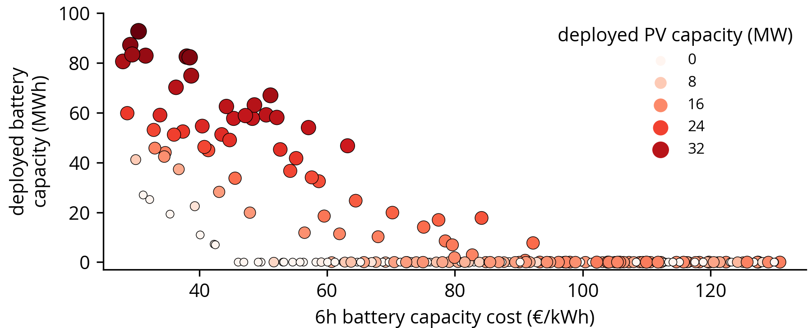

# Takenlijst figuurtjes

Er zijn 3 experimenten
1. Hoge DCAC ratio (PV south) == 2
2. Lage DCAC ratio (PV lower ratio)  == 1/0.7
3. Beide (PV lower + PV higher)

## Daarvan wilt Emiel de volgende plotjes
### Fig. 3. Technology deployment plotted against a single technology capacity cost

    (a) Deployment of solar PV on the y-axis and batteries indicated by colored dots against solar PV capacity cost on the x-axis

 - [ ] Palette to green

    (b) Deployment of batteries on the y-axis and solar PV indicated by colored dots against battery capacity cost on the x-axis

 - [ ] Palette to yellow
 - [ ] Change the x-axis to battery capacity cost regardless of the hour configuration (NOT 6h but €/kWh)
 - [ ] Add top x-axis for the 2h battery capacity cost in €/kWh

### Fig. 4. Technology deployment indicated by colored dots plotted against both solar PV and battery capacity cost

    (a) Deployment of solar PV indicated by colored dots against both solar PV and battery capacity cost

    (b) Deployment of batteries indicated by colored dots against both solar PV and battery capacity cost

- [ ] Heatmap plot with contourlines

### Fig. 5. Relative curtailment against total deployed generation capacity of wind + solar and colored dots indicating battery deployment

- [ ] Palette to green
- [ ] Relative curtailment (inclusief wind)
- [ ] Total added PV capacity die begint vanaf 0 en dus zonder wind

## Nieuwe figuurtjes die we misschien willen hebben
1. Batterij samenstelling tussen verschillende hour configs als functie van batterij opslagkosten
2. Renewable production capacity factor (productie - curtailment) / grid capacity y-as. X-as PV capacity, Z-index battery capacity.
3. Gedrags curves van representaties